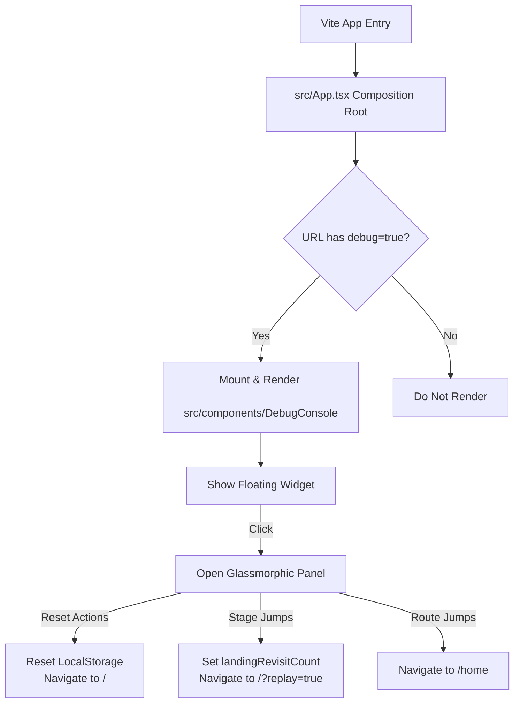

# Debug Mode Console Architecture Blueprint (RE:FUTURE)

This document describes the design and topology of the zero-intrusion, parameter-activated **Debug Console** for the RE:FUTURE single-page application.

---

## 1. Architectural Goals & Boundary Constraints

* **Zero Intrusion**: The debug component must not leak any development states into production schemas. It must not alter the internal code paths of core components (such as `LandingPage` or `HomePage`).
* **Decoupled Lifecycle**: The component is self-contained. It independently parses URLs, modifies `LocalStorage` states, and controls Router navigations. Removing the component must cause zero side-effects.
* **On-Demand Mounting**: The controller only mounts and renders when the URL query explicitly contains `debug=true`.

---

## 2. Component Structure & Data Flow

---

## 3. Interactive Interface Layout (DebugConsole.tsx)

The Debug Console consists of a floating dashboard positioned at the bottom-right corner.

### State Monitor Panel
* **LocalStorage.greenTechJourneyStarted**: Display current boolean value.
* **LocalStorage.landingRevisitCount**: Display current integer count.

### Quick Command Deck (Button Deck)
1. **⚙️ Reset All (New Dev)**:
   * Sets `greenTechJourneyStarted = false`, `landingRevisitCount = 0`.
   * Navigates to `/` (without parameters) to trigger the full, first-time cinematic scrolling intro.
2. **🎬 Play Revisit 1**:
   * Sets `greenTechJourneyStarted = true`, `landingRevisitCount = 0` (so departure sets it to 1).
   * Navigates to `/?replay=true` (loads Level 1 smoke overlay).
3. **🌱 Play Revisit 2**:
   * Sets `greenTechJourneyStarted = true`, `landingRevisitCount = 1` (so departure sets it to 2).
   * Navigates to `/?replay=true` (loads Level 2 green city view).
4. **🏙️ Play Revisit 3 (Secret Nav)**:
   * Sets `greenTechJourneyStarted = true`, `landingRevisitCount = 2` (so departure sets it to 3).
   * Navigates to `/?replay=true` (loads Level 3 navigation deck).
5. **🏠 Go To Home**:
   * Navigates straight to `/home`.

---

## 4. Documentation & Guideline Synced

* **`DISTRIBUTIONS.md`**: Update directory hierarchy under `src/components/` to catalog `DebugConsole/`.
* **`README.md`**: Left untouched (complies with `docs/hand-off.md`).
