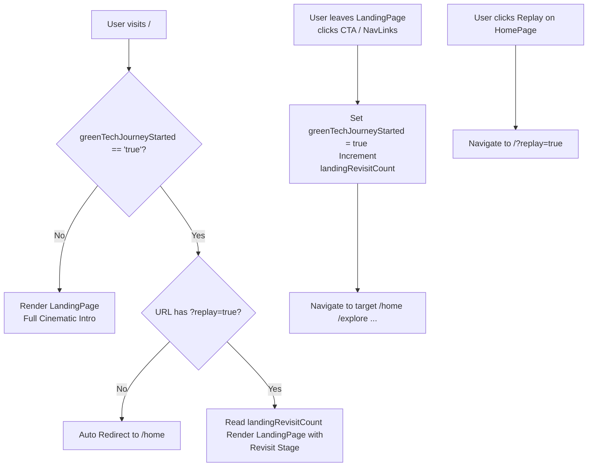

# Routing and Revisit Architecture Blueprint (RE:FUTURE)

This document specifies the routing redirection and revisit/replay mechanism design for the RE:FUTURE application, combining standard SPA routing behavior with custom narrative state tracking.

---

## 1. Context & Architectural Problem

We need to balance two core user experience requirements:
1. **Direct Routing Rule**: 
   * A first-time visitor must see the cinematic, scroll-bound landing page (`/`).
   * A returning visitor (who has already completed the landing page once) should skip the landing page and land directly on the main gateway home page (`/home`) upon opening the site.
2. **Revisit/Replay Narrative**:
   * If a returning visitor explicitly chooses to revisit/replay the landing page (e.g. by clicking a replay link), they should not see the default intro again. Instead, they should witness a progressive series of cinematic Easter eggs based on the number of revisit attempts, as specified in `docs/landing-page-design.md`.

---

## 2. Narrative States & LocalStorage Schema

We will use two local storage variables to track the user's progress:

| Key | Type | Description |
| :--- | :--- | :--- |
| `greenTechJourneyStarted` | `boolean` (`'true'` / `'false'`) | Marks whether the user has clicked the entry CTA on the landing page at least once. |
| `landingRevisitCount` | `integer` (string representations) | Accumulates how many times the user has explicitly replayed/revisited the `/` route after starting their journey. |

---

## 3. Redirect & Guard Flow

The routing guard logic in `src/App.tsx` (the composition root) will control the entry flow:

---

## 4. Revisit Attempt Layouts (LandingPage.tsx)

When the `LandingPage` is mounted in **Revisit Mode** (triggered by `?replay=true` and `greenTechJourneyStarted === 'true'`), the component will branch into different layouts based on `landingRevisitCount`:

* **`Revisit Stage 1` (`landingRevisitCount == 1`)**:
  * Dark screen, fading smoke particles.
  * *Text*: "Once you've reached for a greener future... You don't walk back into the smoke." ➡️ "The journey has already begun."
  * *UI*: Single CTA to return to Home.
* **`Revisit Stage 2` (`landingRevisitCount == 2`)**:
  * Render the old industrial city scene, but color-shifted or styled to look clean and eco-friendly (greener future landscape).
  * *Text*: "You have seen what was. Now discover what can be."
* **`Revisit Stage 3+` (`landingRevisitCount >= 3`)**:
  * Secret cinematic ending: Fossil energy scene animated in reverse, machines and smoke frozen.
  * Transform into a green particle storm.
  * Reveal a hidden navigation bar with quick links to all main sites:
    * Explore Energy, Green Technologies, Projects, Quiz, Future Vision.

---

## 5. Implementation Roadmap (DAG Nodes)

1. **`App.tsx` Guard**: Implement `LocalStorage` checks and parameter checking (`?replay=true`) in the router layout.
2. **CTA Callback**: Bind `localStorage.setItem('greenTechJourneyStarted', 'true')` to the CTA button trigger inside the Landing Page component.
3. **HomePage Navigation**: Update the "Replay" link inside `src/pages/HomePage/HomePage.tsx` to target `/?replay=true`.
4. **Revisit States**: Add rendering branches to `LandingPage.tsx` corresponding to the revisit levels.
