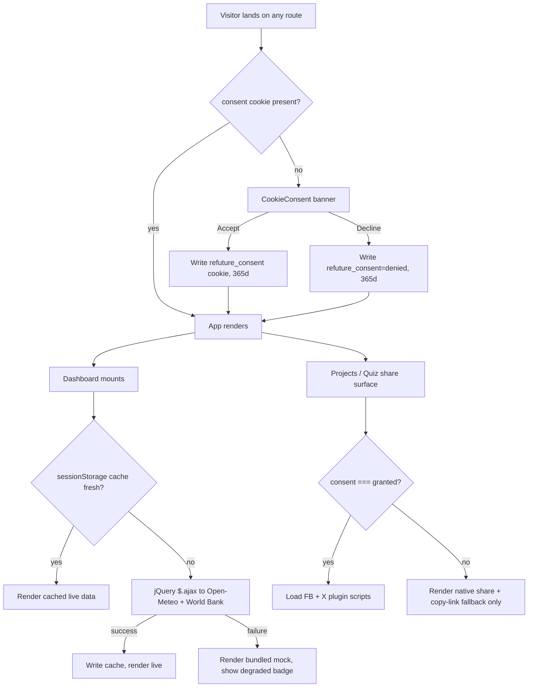

# PRD — Rubric Uplift: Storage, jQuery REST, Social Plugins

## S1 Business Vision & Core Flow

The RE:FUTURE site is assessed against a coursework rubric in which three graded criteria are
currently unmet or partially met: browser storage breadth (15%), RESTful API consumption via
jQuery plus social media plugins (10%), and overall UI/UX (15%). This engagement closes the two
gaps that carry the most unearned marks — the site today persists only three `localStorage` keys,
makes zero network calls, and embeds zero social plugins.

The design intent is not to bolt on three disconnected demos. The three features interlock: a
consent cookie governs whether third-party social scripts may load, and a sessionStorage TTL cache
sits in front of the jQuery REST layer. That coupling makes each mechanism observably load-bearing
rather than decorative, which is what a grader looks for.



## S2 Functional Design

### Module STO — Browser Storage Layer

**Interaction flow.** On first paint the consent gate reads `document.cookie`. Absent a decision, a
banner renders above all content with Accept / Decline. Either choice writes a cookie with a
365-day expiry and dismisses the banner permanently. In parallel, quiz progress writes to
`sessionStorage` on every answer and is offered back as a resume prompt if the tab is refreshed
mid-quiz.

**Behavioral contract.** All three storage mechanisms are accessed exclusively through
`src/utils/storage.ts` and `src/utils/cookies.ts`. Direct `localStorage.*`, `sessionStorage.*` or
`document.cookie` access outside those two modules is prohibited — a storage call that throws
(Safari private mode, quota exceeded, disabled cookies) must degrade to in-memory behavior, and a
scattered call site cannot do that consistently.

**API contract.** Local module surface, no network:

| Function | Signature | Notes |
|---|---|---|
| `safeLocal.get` | `(key: string) => string \| null` | Returns `null` on any throw |
| `safeLocal.set` | `(key: string, value: string) => boolean` | `false` on quota/security error |
| `safeSession.getJSON<T>` | `(key: string) => T \| null` | `null` on parse failure |
| `safeSession.setJSON` | `(key: string, value: unknown) => boolean` | |
| `getCookie` | `(name: string) => string \| null` | |
| `setCookie` | `(name, value, opts: {days, path, sameSite, secure}) => void` | `SameSite=Lax` default |
| `removeCookie` | `(name: string, path?: string) => void` | Expiry set to epoch |

### Module API — jQuery REST Layer

**Interaction flow.** DashboardPage mounts → `useLiveEnergyApi` checks the sessionStorage cache →
on miss, issues two concurrent jQuery requests → renders live values with a source badge and a
last-updated timestamp → a manual Refresh control bypasses the cache.

**Behavioral contract.** Network IO lives only in `src/api/`. Hooks and components never call
`$.ajax` directly (IO separation — required so the transport can be unit-tested without mounting a
component). Every response is validated at the boundary before it reaches React state; a malformed
payload is treated identically to a network failure.

**API contract — upstream endpoint 1 (solar/wind forecast):**

```
GET https://api.open-meteo.com/v1/forecast
Auth: none (public, keyless)
Query:
  latitude          number  required
  longitude         number  required
  hourly            string  required  "shortwave_radiation,wind_speed_10m"
  forecast_days     number  optional  default 1
200 -> { hourly: { time: string[], shortwave_radiation: number[], wind_speed_10m: number[] },
         hourly_units: { shortwave_radiation: string, wind_speed_10m: string } }
Errors: 400 invalid coords | timeout (client, 8000ms) | 0/CORS network unreachable
```

**API contract — upstream endpoint 2 (renewable share of consumption):**

```
GET https://api.worldbank.org/v2/country/{iso3}/indicator/EG.FEC.RNEW.ZS
Auth: none (public, keyless)
Query:
  format            string  required  "json"
  per_page          number  optional  default 60
  date              string  optional  "2000:2023"
200 -> [ meta, [ { country: {id,value}, date: string, value: number|null } ] ]
Errors: 200-with-error-body (World Bank returns HTTP 200 for bad indicator) | timeout | network
```

Both endpoints were probed on 2026-08-12 and confirmed to return
`Access-Control-Allow-Origin: *` with no API key.

### Module SOC — Social Media Plugins

**Interaction flow.** A share surface renders on the Projects detail modal and the Quiz result
screen. If consent is granted, the Facebook Share plugin and X Tweet button hydrate from their
vendor scripts. If consent is denied or a script fails to load within its timeout, the surface
falls back to the Web Share API where available and a copy-link button everywhere else — the user
always has a working share path.

**Behavioral contract.** Third-party scripts are loaded only through
`src/utils/loadExternalScript.ts`, which is idempotent per URL, promise-based, and time-boxed. No
vendor script may be injected before the consent cookie reads `granted`.

**API contract — vendor assets (all keyless, probed 2026-08-12, all HTTP 200):**

| Vendor | Asset | Mechanism |
|---|---|---|
| Facebook | `https://www.facebook.com/plugins/share_button.php` | `<iframe>` plugin, no SDK, no App ID |
| Facebook | `https://www.facebook.com/plugins/page.php` | `<iframe>` page plugin |
| X (Twitter) | `https://platform.twitter.com/widgets.js` | Script, hydrates `.twitter-share-button` |

## S3 Functional Requirements

### STO — Browser Storage

| ID | Requirement |
|---|---|
| FR-STO-001 | The system **shall** expose typed wrappers for `localStorage` and `sessionStorage` that return `null`/`false` instead of throwing when the underlying store is unavailable. |
| FR-STO-002 | The system **shall** expose a cookie utility supporting read, write with an expiry in days, `path`, `SameSite`, and `Secure` attributes, and removal. |
| FR-STO-003 | The system **shall** render a consent banner on any route when no `refuture_consent` cookie exists, and **shall not** render it once a decision cookie exists. |
| FR-STO-004 | The system **shall** persist the consent decision as a cookie named `refuture_consent` with value `granted` or `denied` and a 365-day expiry. |
| FR-STO-005 | The system **shall** persist in-progress quiz state (current index, responses, selected answer) to `sessionStorage` on every answer submission, and **shall** offer resume when that state exists on mount. |
| FR-STO-006 | The system **shall** clear persisted quiz `sessionStorage` state when the quiz completes or is restarted. |

### API — jQuery REST

| ID | Requirement |
|---|---|
| FR-API-001 | The system **shall** perform all upstream HTTP calls using jQuery (`$.ajax` / `$.getJSON`), not `fetch` or `axios`. |
| FR-API-002 | Every request **shall** apply an 8000 ms timeout and **shall** normalize jQuery's error triple into a single typed `ApiError { kind, status, message }`. |
| FR-API-003 | The system **shall** retry a failed request at most twice with exponential backoff (500 ms, 1000 ms), and **shall not** retry HTTP 4xx responses. |
| FR-API-004 | The system **shall** cache successful responses in `sessionStorage` under a versioned key with a 10-minute TTL, and **shall** serve a fresh cache entry without issuing a network call. |
| FR-API-005 | The system **shall** validate the shape of every response at the boundary and **shall** treat a shape violation as a fetch failure. |
| FR-API-006 | The DashboardPage **shall** render bundled mock data with a visible `DEGRADED` indicator when live data is unavailable, and **shall never** render an empty or broken panel. |

### SOC — Social Plugins

| ID | Requirement |
|---|---|
| FR-SOC-001 | The system **shall** load external vendor scripts only via an idempotent loader that resolves once per URL and rejects after a 6000 ms timeout. |
| FR-SOC-002 | The system **shall not** inject any third-party social script or iframe while `refuture_consent` is absent or `denied`. |
| FR-SOC-003 | The system **shall** render a Facebook share plugin and an X (Twitter) share button on the Projects detail view and the Quiz result view when consent is `granted`. |
| FR-SOC-004 | The system **shall** render a copy-link control at all times, and the Web Share API control when `navigator.share` exists, independent of consent state. |
| FR-SOC-005 | The system **shall** render an embedded social feed panel on the About page when consent is `granted`, and an explanatory placeholder with an enable-consent affordance when it is not. |

## S4 Non-Functional Requirements

| ID | Requirement | Threshold |
|---|---|---|
| NFR-001 | Live-data panel first contentful render is not blocked by network | Dashboard interactive ≤ 100 ms after mount regardless of API state |
| NFR-002 | API request timeout | 8000 ms hard ceiling per attempt |
| NFR-003 | Vendor script timeout | 6000 ms, after which fallback UI renders |
| NFR-004 | Retry ceiling per user-initiated fetch | ≤ 3 total attempts; no unbounded retry |
| NFR-005 | Cache TTL | 600 s; stale entries discarded, not served |
| NFR-006 | Added bundle weight from jQuery | ≤ 90 KB gzipped |
| NFR-007 | Consent banner accessibility | Reachable by keyboard, `role="dialog"`, `aria-labelledby`, contrast ≥ 4.5:1 |
| NFR-008 | Storage failure tolerance | Zero uncaught exceptions when all three stores throw |
| NFR-009 | Data retention | No PII in any store; consent cookie 365 d, quiz state cleared at tab close |
| NFR-010 | Test coverage of new modules | Every FR has ≥ 1 automated test asserting its behavior |

## S5 Boundary & Exception Handling

| Scenario | Trigger → Detection → Response → Recovery → Logging |
|---|---|
| Network timeout | Request exceeds 8000 ms → jQuery `textStatus === 'timeout'` → normalize to `ApiError{kind:'timeout'}` → retry ≤ 2 with backoff, then mock fallback → `console.warn` with endpoint + attempt |
| Third-party API unavailable | 5xx or `status === 0` → status inspection in `error` handler → `ApiError{kind:'network'\|'server'}` → serve cache if present else mock, badge `DEGRADED` → `console.warn` |
| Malformed payload | Upstream shape change → boundary validator returns false → `ApiError{kind:'shape'}` → treated as failure, cache **not** written → `console.error` with received keys |
| Vendor script blocked | Adblock / offline / CSP → loader promise rejects or times out at 6000 ms → render fallback share controls → no retry → `console.info`, silent to user |
| Storage disabled | Private mode / quota → wrapper `try/catch` → return `null`/`false` → app runs with in-memory defaults, banner may re-show per session → `console.warn` once |
| Concurrent write conflict | Two tabs writing quiz state → last-write-wins on `sessionStorage` (per-tab, so not observable) → no cross-tab contention by design → n/a |
| Unauthorized access | n/a — all endpoints public, no credentials, no auth token is ever sent | Enforced by review: no `xhrFields.withCredentials`, no auth headers |
| Boundary input values | `value: null` in World Bank series, empty `hourly` arrays, all-zero radiation at night → validator + reducer guards → skip nulls, render `—` for empty, treat 0 as valid | `console.error` only on total-empty |
| Retry storm | Rapid Refresh clicks → in-flight guard flag → subsequent clicks ignored while a request is pending → button disabled during fetch → n/a |

## S6 Acceptance Criteria

| ID | Maps to | Given / When / Then |
|---|---|---|
| AC-STO-001 | FR-STO-001 | **Given** `localStorage.setItem` throws, **When** `safeLocal.set` is called, **Then** it returns `false` and no exception escapes. |
| AC-STO-002 | FR-STO-002 | **Given** `setCookie('k','v',{days:1})`, **When** `getCookie('k')` runs, **Then** it returns `'v'`; **and** after `removeCookie('k')` it returns `null`. |
| AC-STO-003 | FR-STO-003 | **Given** no consent cookie, **When** the app mounts, **Then** a `role="dialog"` banner is in the document; **Given** a consent cookie, **Then** it is absent. |
| AC-STO-004 | FR-STO-004 | **Given** the banner, **When** Accept is clicked, **Then** `document.cookie` contains `refuture_consent=granted` and the banner unmounts. |
| AC-STO-005 | FR-STO-005 | **Given** two answered questions, **When** the component remounts, **Then** a resume affordance appears and restores index 2 with both responses. |
| AC-STO-006 | FR-STO-006 | **Given** a completed quiz, **When** completion renders, **Then** the `sessionStorage` progress key is absent. |
| AC-API-001 | FR-API-001 | **Given** the built source, **When** searched, **Then** upstream calls resolve to jQuery methods and no `fetch(`/`axios` call exists in `src/api/`. |
| AC-API-002 | FR-API-002 | **Given** a request that times out, **When** it settles, **Then** the rejection is an `ApiError` with `kind === 'timeout'`. |
| AC-API-003 | FR-API-003 | **Given** a 500 response, **When** the client runs, **Then** exactly 3 attempts occur; **Given** a 404, **Then** exactly 1 attempt occurs. |
| AC-API-004 | FR-API-004 | **Given** a cache entry written 1 min ago, **When** fetch is called, **Then** zero requests are issued; **Given** one written 11 min ago, **Then** a request is issued. |
| AC-API-005 | FR-API-005 | **Given** a 200 response missing `hourly`, **When** parsed, **Then** it rejects with `kind === 'shape'` and no cache entry is written. |
| AC-API-006 | FR-API-006 | **Given** every request fails, **When** the Dashboard renders, **Then** mock values and a `DEGRADED` badge are visible and no error boundary trips. |
| AC-SOC-001 | FR-SOC-001 | **Given** two concurrent calls for one URL, **When** both settle, **Then** exactly one `<script>` was appended. |
| AC-SOC-002 | FR-SOC-002 | **Given** consent is `denied`, **When** the share surface mounts, **Then** no `facebook.com` or `twitter.com` node exists in the DOM. |
| AC-SOC-003 | FR-SOC-003 | **Given** consent is `granted`, **When** the share surface mounts, **Then** the FB plugin iframe and the X share anchor are present. |
| AC-SOC-004 | FR-SOC-004 | **Given** consent is `denied`, **When** the share surface mounts, **Then** a copy-link button is present and functional. |
| AC-SOC-005 | FR-SOC-005 | **Given** consent is `denied`, **When** About renders, **Then** a placeholder with an enable affordance appears instead of the embed. |

## S7 Assumptions, Dependencies & Risks

**Assumptions**

| Assumption | Owner | Validation method |
|---|---|---|
| Grading environment has internet access at demo time | Human | Unvalidated — mitigated by mock fallback (FR-API-006) so the site scores on UI/UX regardless |
| Open-Meteo and World Bank remain keyless and CORS-open | COA | Probed 2026-08-12; re-probe before submission |
| No CSP header is enforced on the deploy target | COA | `index.html` carries no CSP meta; static Vite build |

**Dependencies**

| Dependency | Blocking | Owner |
|---|---|---|
| `jquery` + `@types/jquery` npm packages | Yes — M2 cannot start without | CDE |
| Open-Meteo Forecast API | No — mock fallback exists | External |
| World Bank Indicators API | No — mock fallback exists | External |
| `platform.twitter.com/widgets.js` | No — fallback share exists | External |

**Risks**

| Risk | Probability | Impact | Mitigation |
|---|---|---|---|
| Adblocker suppresses social plugins during grading | High | Medium | Fallback share controls always render; embed placeholder explains state |
| Grader interprets "jQuery" strictly and inspects source | High | High | jQuery is the actual transport, not a wrapper over `fetch` — verifiable in `src/api/http.ts` |
| jQuery adds bundle weight to a React app | Certain | Low | Accepted; NFR-006 caps it. Rubric compliance outranks bundle purity here |
| Consent gate hides plugins from the grader | Medium | High | Banner is the first thing shown; Accept is the primary action |
| React 18 StrictMode double-mount duplicates script injection | Medium | Low | Loader idempotency (FR-SOC-001) covers this directly |

## S8 Out of Scope

| Excluded | Reason |
|---|---|
| Backend/server of our own | Rubric asks for consuming a RESTful API, not authoring one |
| Real Facebook App ID / OAuth login | Requires credentials and app review; keyless plugins satisfy the rubric |
| Replacing all mock data with live data | Only the Dashboard live panel needs a genuine call; wholesale replacement risks UI regressions against the 15% UI/UX criterion |
| Analytics or tracking cookies | Not graded; adds privacy surface for no mark |
| Mobile-responsive fixes for landing-sequence components | Real gap, but belongs to the UI/UX criterion — tracked separately, not in this PRD |

## S9 Open Questions

| # | Question | Why it must be answered explicitly |
|---|---|---|
| Q1 | Will the demo machine have internet? | Determines whether live data or the degraded path is what the grader sees. Not blocking — both paths are built. |
| Q2 | Is there a deployment target, or is grading done from a local `npm run dev`? | Determines whether DDE performs a real deploy or git versioning only. Defaulted to **git versioning only**; no deploy target is configured in the repo. |
| Q3 | Does the assignment prohibit third-party CDN assets? | Would invalidate the vendor-script approach. No such constraint is visible in the rubric text supplied. |

No item in this PRD touches payments, sensitive personal data, or regional regulation.
