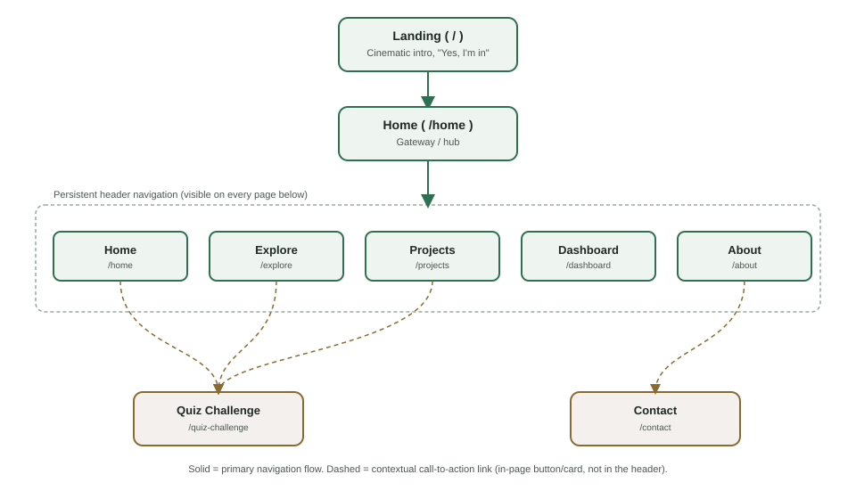
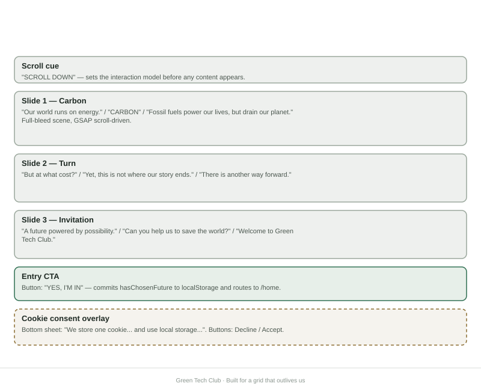
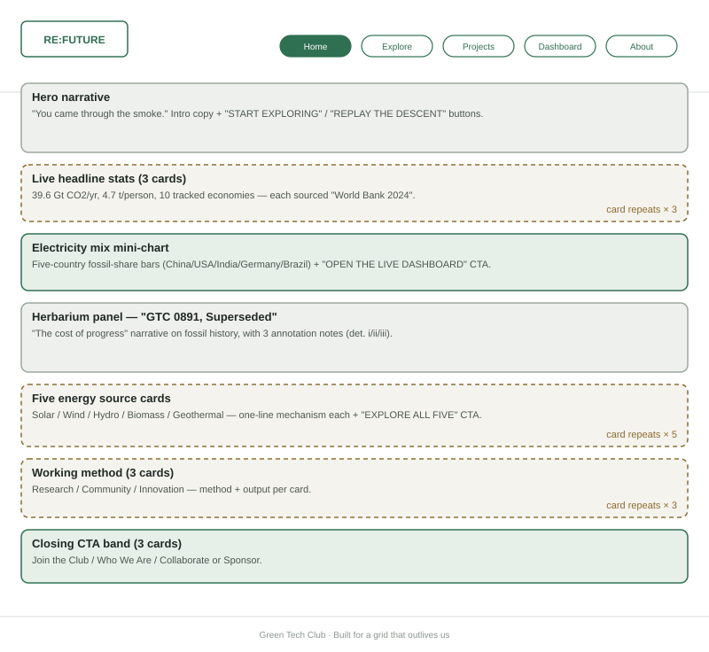
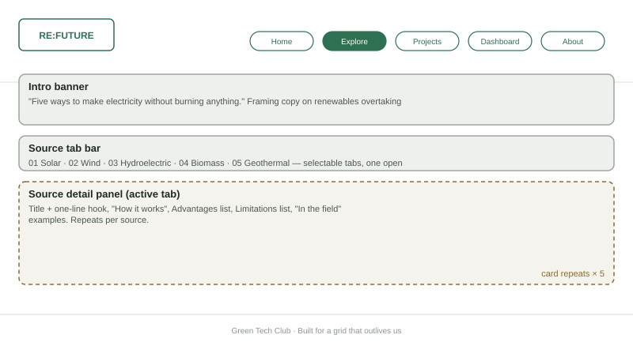
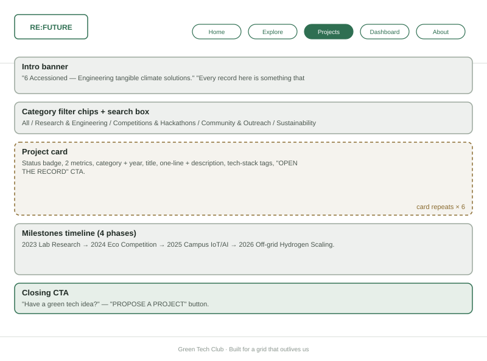
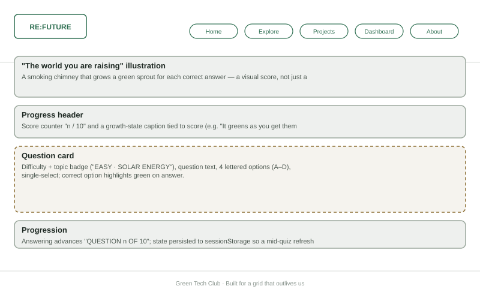
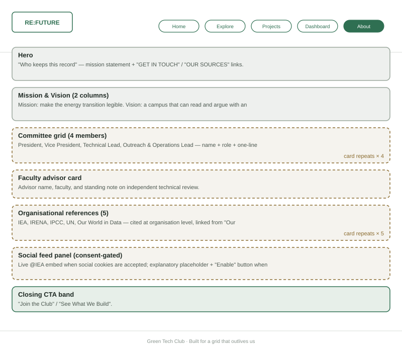
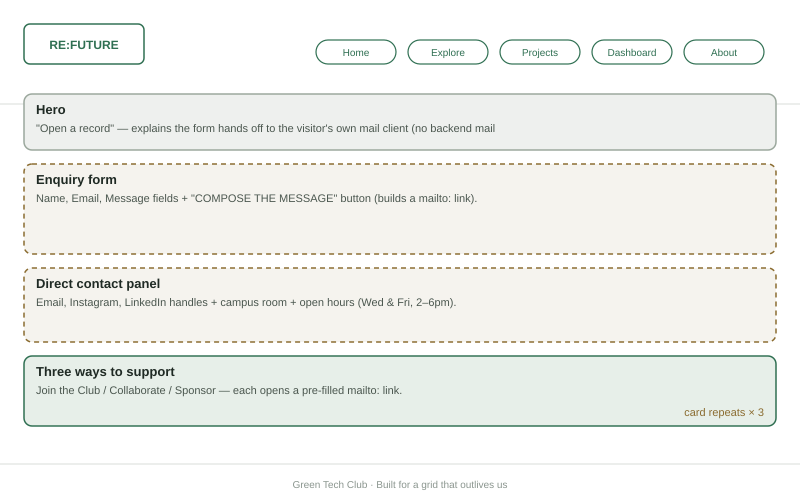
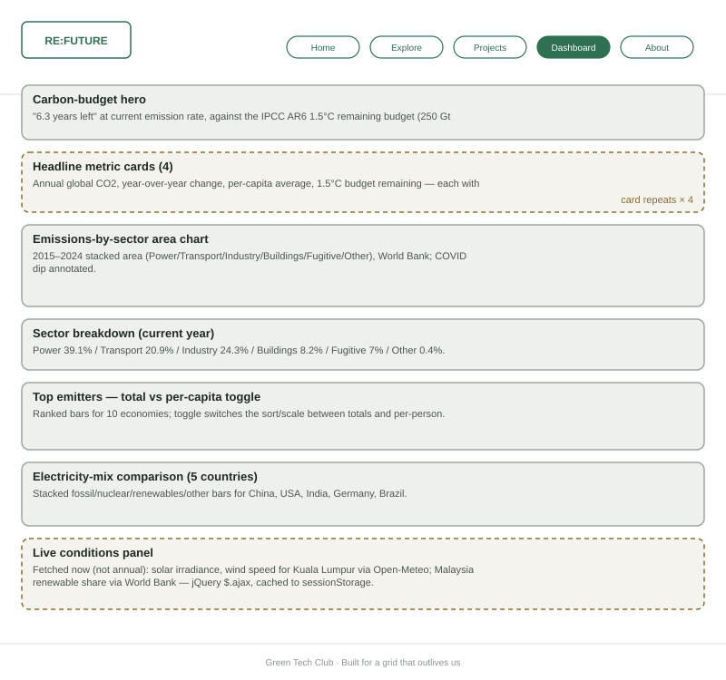

# UCCD2323 Front-End Web Development: Assignment Report

**Website title:** RE:FUTURE (Green Tech Club)
**Target case:** Green Technology Club (Universiti Tunku Abdul Rahman)

> The cover page, member's contribution sheet, marking rubric, table of contents and Turnitin report are handled separately and are not included in this file. This document covers Chapters 1 to 4 and the reference list only, as requested.

---

# Chapter 1: Introduction

## 1.1 Background of the Study

Renewable energy and sustainable technologies have become very important in addressing global environmental challenges such as climate change, greenhouse gas emissions and the depletion of fossil fuels. In the past, energy production mainly depended on non-renewable sources such as coal, oil and natural gas, which contributed substantially to environmental pollution. Fossil fuels still made up close to 60% of global electricity generation in 2024, with coal alone accounting for 35% of total power generation [1]. As technology advances and environmental awareness increases, renewable energy sources such as solar, wind and hydroelectric power have gained significant momentum worldwide, with global renewable power capacity growing by a record 585 GW (15.1%) in 2024 and renewables now accounting for 46% of all installed power-generation capacity globally [2].

In current trends, the adoption of distributed renewable energy systems and intelligent energy management has accelerated as Internet of Things (IoT) sensors, artificial intelligence, and real-time data analytics are used to optimise clean energy generation and consumption [3]. Educational institutions, organisations and communities are increasingly deploying green technologies such as rooftop solar arrays, smart microgrids, and automated energy monitoring to reduce carbon emissions and protect the environment. Many people still lack awareness and practical understanding of these technologies and why they matter, particularly students who are not majoring in energy or environmental fields.

Therefore, the **Green Tech Club** was created to share information about renewable energy and sustainable technologies with the campus community. Rather than presenting this as a static list of facts, the club's website (RE:FUTURE) frames sustainability as a journey, moving from understanding the environmental cost of fossil fuels, to exploring how renewable energy actually works, to seeing the club's own student-led projects. Through this website, users can participate in green technology activities, test their own understanding through an interactive quiz, and follow live, sourced data on the state of the global energy transition rather than only static claims.

## 1.2 Target Audience

The target audience of the Green Tech Club website can be understood from several overlapping perspectives. The first and largest group is university students, particularly at UTAR, who want to learn about renewable energy and sustainability in an engaging, low-commitment way, and who may be considering joining the club themselves. Closely related to this group are prospective and existing club members, who need a central place to find out what the club does, who runs it, and how to get involved, propose a project, or sponsor an activity. Beyond the university, the site also serves teenagers and self-directed learners who are simply curious about how solar, wind, hydro, biomass and geothermal energy work, and who benefit from the plain-language explanations provided on the Explore page. Finally, faculty members, sponsors and partner organisations form a smaller but important audience, using the Projects and About pages to evaluate the club's track record and technical credibility before collaborating or funding equipment. Each of these groups is served by a different entry point into the same site, so that a student who only wants a five-minute overview can stop at the Home page, while a sponsor evaluating the club's work can go straight to Projects and About.

## 1.3 Problem Description

Although information about green technology is already available on the internet, it is scattered across many different websites, government portals, and academic papers, which makes it hard for a student with no background in the field to find reliable, organised, and digestible information. Furthermore, many university environmental and technology clubs still rely on scattered social media posts and email blasts to communicate, channels that are not designed for structured, long-form educational content and that quickly bury older material under newer posts.

Without a dedicated website, club members and interested students run into several concrete difficulties. Nowhere brings together the actual mechanism behind renewable energy sources, such as how a solar cell or a wind turbine generates electricity, rather than simply asserting that these technologies exist. An outsider has no easy way to see what the club has actually built or accomplished beyond word of mouth, and no lightweight way to test or reinforce what they have just learned. Nor is there a transparent, sourced view of how serious the underlying problem of global carbon emissions actually is, as opposed to vague statements such as "climate change is bad." A centralised, purpose-built website is therefore needed to organise this information, demonstrate the club's credibility through real project records, and make the underlying data checkable rather than merely asserted.

## 1.4 Significance

The Green Tech Club website answers these problems directly. The Explore page centralises learning by organising renewable energy into five sources, solar, wind, hydroelectric, biomass and geothermal, each covering how it works, its advantages, its limitations, and where it is used in practice, so a visitor gets one consistent structure instead of scattered and inconsistent information. Rather than repeating the general claim that fossil fuels are harmful, the Home and Dashboard pages favour evidence over assertion: they pull live and recent figures from public data providers such as the World Bank and Open-Meteo, so a visitor can see the actual scale of global emissions, how the electricity mix differs between countries, and how close the world is to the IPCC's 1.5°C carbon budget. Credibility is demonstrated rather than claimed on the Projects page, which documents six real, in-progress or completed student projects, including a campus microgrid digital twin, a solar racing prototype, and an AI waste-sorting station, letting prospective members, sponsors and faculty see that the club produces tangible engineering work and not just discussion. The Quiz Challenge page converts that same Explore content into a ten-question interactive quiz, so a visitor tests what they have learned instead of only scrolling past it. The Contact and About pages, in turn, lower the barrier to joining by turning membership, collaboration and sponsorship into explicit, low-friction actions, a pre-filled email draft, a named committee, a stated meeting time and room, rather than leaving visitors with an ambiguous "get involved" banner. Taken together, this gives the club's own work a permanent, citable home and supports a more environmentally conscious student community on campus.

---

# Chapter 2: Literature Review

To evaluate how the Green Tech Club website compares to existing practice, three existing websites were reviewed: Northvolt, a large sustainable-battery manufacturer; GSTAM, the Green Science and Technology Association Malaysia, a local environmental NGO and one of the sample sites named directly in the assignment brief for this title; and the Boston University CleanTech Club, a university student club that is most directly comparable in scope, audience and resources to the Green Tech Club.

## 2.1 Existing Website 1: Northvolt

Northvolt (https://northvolt.com/) [5] is a European battery manufacturer whose site positions the company as a leader in sustainable lithium-ion cell production, with a stated goal of delivering batteries with a far lower carbon footprint than coal-powered alternatives. The main navigation covers Why Northvolt, Products, Sustainability, Career and Recycling, supporting both business customers and recruitment.

The site's main advantage is a clear, single value proposition stated immediately, backed by concrete sustainability figures and a dedicated battery-recycling programme called Revolt. It also offers comprehensive, well-segmented product information for different markets such as automotive, grid and industrial applications, suited to a technically literate audience, and it presents a clean, minimalist visual design with strong whitespace discipline and consistent typography. Contact and career channels are multiple and clearly labelled. At the same time, the site has clear limitations for a student audience. It is built for a corporate, investor and business-to-business audience, so its dense, text-heavy sections would be intimidating rather than inviting for a visitor with no energy background, and its sustainability claims and data visualisations are largely presented as static images or prose rather than as interactive, checkable data. There is no educational "how it works" layer for a visitor who does not already know what a lithium-ion cell or a gigafactory is, and no interactive or gamified element anywhere on the site: the experience is entirely read-only. For our own system, the lesson taken from Northvolt is to keep its discipline around a clear, single-sentence framing per section, while replacing its assumption of prior expertise with the plain-language, mechanism-first explanations used on our Explore page.

## 2.2 Existing Website 2: Green Science and Technology Association Malaysia (GSTAM)

GSTAM (https://gstam.org/) [6] is a Malaysian NGO promoting environmental sustainability through green science and technology, covering energy conservation, recycling and ecosystem restoration. Its navigation is a simple horizontal menu consisting of Home, About Us, What We Do, Green Science and Technology, Photo Gallery, Donate and Register Member, with a contact number shown prominently in the header.

The organisation's purpose is stated clearly and immediately. Multiple calls to action, such as donating, registering and making contact, are always visible, keeping engagement paths short within a traditional, centred layout that is easy to navigate for a non-technical visitor. However, the site has no visible news, blog or events section, so there is no sense of the organisation's current activity or momentum. Its content is almost entirely static text with minimal supporting imagery or data and no visible update timestamps, so a visitor cannot tell whether the page reflects last year or last week. It also gives no explanation of how the technologies it promotes actually work, talking about outcomes and goals rather than mechanisms, and it offers no interactivity beyond a contact form: no quiz, no dashboard, no way for a visitor to explore a topic at their own pace. GSTAM shows that clarity of purpose and visible calls to action matter, but it also shows the cost of a site with no dynamic content, which is exactly the gap our own Dashboard page's live-fetched figures and dated sourcing are designed to close.

## 2.3 Existing Website 3: Boston University CleanTech Club

The Boston University CleanTech Club site (https://sites.bu.edu/cleantech/) [7] is the closest match in kind to our target case, being a university student club focused on sustainable technology. It covers four sections: Who Are We?, What is 'CleanTech'?, What do We Do?, and Connect with CleanTech Club, alongside a photo carousel of past events and links to the club's social channels and Slack community.

The site directly answers the three questions a prospective member actually has, namely what the club is, what the field is, and what a meeting looks like, and its real event photography gives a genuine sense of an active, in-person community, supported by low-friction ways to join such as a newsletter and a Slack invite rather than a single generic contact form. Its main weaknesses are the absence of a dedicated events calendar or dated project records, so a visitor cannot tell what the club is working on right now and only sees what it has done historically, with some images appearing to date from 2022 to 2023. There is also no showcase of concrete outputs such as prototypes, competition results or measurable impact beyond a description of "what we do" in the abstract, and the navigation is shallow, with only four top-level items that would not scale to a larger body of educational content, while the site itself remains a static informational brochure with no interactive or data-driven element. This is the strongest single comparator among the three, and the gap it leaves is exactly what our own Projects page, with its dated, categorised, metric-bearing project records, and our Dashboard page, which stays continuously current rather than being photographed once and left, are designed to close.

## 2.4 Comparative Summary

| Criterion | Northvolt [5] | GSTAM [6] | BU CleanTech Club [7] | Green Tech Club (this site) |
|---|---|---|---|---|
| Explains how the technology works | Partial | No | No | Yes (Explore page, per source) |
| Shows dated, concrete project output | N/A | No | Partial (undated photos) | Yes (Projects page, dated and categorised) |
| Live / current data, not just static claims | No | No | No | Yes (Dashboard: World Bank, Open-Meteo via RESTful API) |
| Interactive / participatory element | No | No | No | Yes (10-question Quiz Challenge) |
| Clear, low-friction path to join/contact | Yes | Yes | Yes | Yes (mailto-based Contact form, no backend needed) |
| Built for a non-expert audience | No | Partial | Yes | Yes |
| Named, accountable ownership (committee/advisor) | N/A (corporate) | No | No | Yes (About page lists committee and faculty advisor) |

Comparing the three sites against the Green Tech Club website across these criteria shows a consistent pattern. Northvolt explains how a technology actually works only partially; GSTAM and the BU CleanTech Club do not attempt it at all; the Green Tech Club's Explore page does so systematically for every source. None of the three comparators show dated, concrete project output in any real sense: the criterion does not apply to the corporate Northvolt site, GSTAM shows none, and BU CleanTech Club offers only undated photographs, while the Green Tech Club's Projects page dates and categorises every record. The same gap appears with live or current data and with any interactive or participatory element: none of the three comparators offer either, whereas the Green Tech Club pulls current figures from the World Bank and Open-Meteo through a RESTful API and provides a ten-question Quiz Challenge. Where the comparators do hold their own is in offering a clear, low-friction path to join or make contact, which the Green Tech Club matches with its mailto-based Contact form that needs no backend. Being built for a non-expert audience follows a similar split: Northvolt is not, GSTAM is only partially so, and both BU CleanTech Club and the Green Tech Club are. Named, accountable ownership through a listed committee or advisor is the last point of difference: it does not apply to the corporate Northvolt site and is absent from GSTAM and BU CleanTech Club, but it is present on the Green Tech Club's About page, which names its committee and faculty advisor directly.

## 2.5 How the Green Tech Club Website Differs and Improves

Across all three comparators, the same three gaps recur: claims are not backed by checkable, current data; the mechanism behind a technology is assumed or skipped rather than explained; and there is no way for a visitor to actively engage with the content beyond reading it. The Green Tech Club website was designed specifically against these gaps. Every entry on the Explore page follows the same structure of how it works, its advantages, its limitations, and its real-world use, instead of only stating that a technology is "good for the environment," which handles the first two gaps directly. The third, the lack of live or checkable data, is addressed by having the Dashboard and Home pages call public RESTful APIs, namely Open-Meteo for live weather and the World Bank API for emissions and renewable-share statistics, through jQuery, so the figures shown are fetched at request time and explicitly dated and attributed rather than being a paragraph of text the reader has to take on faith. Where none of the three comparator sites give a visitor any way to engage beyond reading, the Quiz Challenge page does exactly that, letting visitors actively test their understanding rather than passively read it. The Projects page adds a further layer that none of the comparators attempt at all: it demonstrates rather than merely claims credibility, listing six dated, categorised projects with concrete metrics such as classification accuracy, efficiency, and savings identified, closer in spirit to a lab notebook than a brochure. Even the entry point differs. The cinematic Landing sequence uses storytelling as onboarding, giving first-time visitors an emotional "why" before the informational "what," which is not something any of the three comparators attempt.

---

# Chapter 3: Design

## 3.1 Site Map

The site has eight routes. The routes `/home`, `/explore`, `/projects`, `/dashboard` and `/about` sit in the persistent header navigation and are reachable from every page, while `/` (Landing), `/quiz-challenge` and `/contact` are reached through contextual call-to-action links rather than the header, keeping the header itself short and stable.

*Figure 3.1: Site map. Solid arrows are the primary navigation flow from landing to home to the persistent header; dashed arrows are contextual call-to-action links surfaced inside page content.*

## 3.2 Wireframes

The wireframes below are low-fidelity structural sketches, drawn as greyscale blocks labelled with each section's purpose and a summary of its real content, showing what each page contains and in what order, independent of the final visual styling described in section 3.3. Dashed blocks indicate a repeating card pattern, with the caption stating how many times the card repeats.

### 3.2.1 Landing (`/`)

*Figure 3.2: The landing page has no persistent header. It is a single full-bleed, scroll-driven narrative built with GSAP ScrollTrigger, ending in one entry call-to-action, with the cookie-consent banner as the only other interactive element.*

### 3.2.2 Home (`/home`)

*Figure 3.3: The hub page, moving from a hero narrative through three live headline statistics and an electricity-mix mini-chart linking to the Dashboard, a historical framing panel, the five energy-source preview cards linking to Explore, the club's three-part working method, and a closing call-to-action band.*

### 3.2.3 Explore (`/explore`)

*Figure 3.4: A tabbed reference layout with one tab per energy source, each opening the same four-part structure covering mechanism, advantages, limitations, and real-world use.*

### 3.2.4 Projects (`/projects`)

*Figure 3.5: A filterable and searchable project gallery of six records, followed by a four-phase milestone timeline and a closing proposal call-to-action.*

### 3.2.5 Quiz Challenge (`/quiz-challenge`)

*Figure 3.6: A single-focus quiz layout under the same persistent header as the rest of the site, with a "growing world" illustration of a smoking chimney that sprouts green for each correct answer sitting above the score and progress header, followed by one question card at a time with four lettered options.*

### 3.2.6 About (`/about`)

*Figure 3.7: The mission and vision statement, the four-member committee, the faculty advisor, the organisation-level source list, and a consent-gated live social feed panel.*

### 3.2.7 Contact (`/contact`)

*Figure 3.8: A two-part contact surface combining a mailto-based enquiry form that needs no backend with direct contact details, followed by three explicit ways to get involved.*

### 3.2.8 Dashboard (`/dashboard`)

*Figure 3.9: A data-dense analytics layout moving from a headline carbon-budget figure through four sourced metric cards, a historical sector chart, a per-country electricity-mix comparison, and a live-fetched conditions panel at the bottom.*

## 3.3 Visual Design (Page Mockup Description)

Because the wireframes above deliberately omit colour and type, this section describes the actual visual treatment observed on the live pages. Unlike a typical single-palette site, the background tone deliberately changes from page to page to mark a shift in mood, while staying internally consistent within each page. The Landing sequence moves through a full arc on its own, from near-black smoke to warm sunrise gold to soft sky blue, as the visitor scrolls. Home carries a dark, near-black ground behind a forest photograph, with a single green accent used for active navigation, buttons and data highlights. Explore, Projects, About and Contact share a warm, light "herbarium" cream tone that feels paper-like and evokes a specimen catalogue, while the Dashboard uses a cooler light grey-green tone suited to dense data, and Quiz Challenge returns to a dark, ember-toned ground paired with the smoke and growth illustration that reacts to the score. The green accent colour is the one constant that ties every page back to the club identity.

Typography follows a similar two-register logic. Headings and section eyebrows, such as "SOURCE 01 OF 05" or "GREEN TECH CLUB · HERBARIUM OF ENERGY," use a bold, condensed uppercase display face, while body paragraphs switch typeface by context: a monospaced, typewriter-style face is used on the light "herbarium" pages of Explore, Projects, About and Contact to reinforce the "catalogued record" framing, while a plainer sans-serif face is used on Home and the Dashboard, where legibility over long data-heavy passages matters more than editorial voice. Motion is used with the same restraint throughout the site, appearing as GSAP-driven scroll transitions on the Landing page, staggered reveal animations on card grids such as Explore, Projects and the About page's reference list, and a hide-on-scroll header that parks out of the way when the visitor scrolls down and returns when they scroll back up.

Every repeating content type across the site, whether an energy source, a project, a committee member, or a headline statistic, is expressed as the same card shape with a consistent header, body and footer rhythm, so that a visitor learns the pattern once and reuses it on every page. Data-first components such as the Dashboard's charts and the Home page's mini electricity-mix chart use direct labelling, with values printed on the mark itself rather than relying only on a legend, so that a figure remains readable even from a static print or screenshot. Interactive elements confirm themselves visually rather than silently, too: the Quiz Challenge highlights the chosen answer in green on selection, and its growth illustration updates immediately rather than leaving the score number as the only feedback.

---

# Chapter 4: Evaluation

## 4.1 User Manual

This section walks through the working website page by page, as a first-time visitor would use it. Each bracketed screenshot instruction below is a placeholder: this document was produced by reading the running application's rendered content and source code and by verifying its behaviour directly in a live browser session, rather than by embedding captured image files, so the group should replace each marker with an actual screen capture of the corresponding state before the report is finalised. Each instruction states exactly what state or interaction to capture.

Opening the site root shows a full-screen scroll narrative beginning "Our world runs on energy," which advances as the visitor scrolls, ending on the "Welcome to Green Tech Club" panel with a "Yes, I'm in" button. `[SCREENSHOT: the opening "Our world runs on energy" scene, and the final "Welcome to Green Tech Club" panel]`. The cookie-consent banner appears at the bottom of this first screen, explaining that the site stores one cookie to remember the visitor's choice and uses browser local storage to keep their journey and quiz progress, with Decline and Accept buttons. `[SCREENSHOT: the cookie consent banner]`. Clicking "Yes, I'm in" writes a hasChosenFuture flag to localStorage and navigates to /home; returning to the root path afterwards no longer replays the introduction, since the RootRouteGuard component redirects straight to /home unless the visitor explicitly adds ?replay=true to the URL.

On the Home page, the header becomes visible, showing the RE:FUTURE wordmark and a five-item navigation bar for Home, Explore, Projects, Dashboard and About. The page opens with the "You came through the smoke" narrative and Start Exploring and Replay the Descent buttons. `[SCREENSHOT: the header and navigation bar together with the hero section]`. This is followed by three live statistic cards covering annual CO₂, the per-capita average, and the number of tracked economies, alongside a five-country electricity-mix mini-chart. `[SCREENSHOT: the three live statistic cards and the electricity-mix mini-chart]`. Scrolling further reveals the historical "cost of progress" panel, the five energy-source preview cards, the club's three-part working method, and the closing call-to-action band covering Join the Club, Who We Are, and Collaborate or Sponsor. `[SCREENSHOT: the five energy-source preview cards]`.

Selecting Explore in the header opens the five-source reference page, where each of the five tabs for Solar, Wind, Hydroelectric, Biomass and Geothermal opens the same structure of a short hook, how it works, advantages, limitations, and where it is used in the field. `[SCREENSHOT: the Solar tab open, showing the full how-it-works, advantages and limitations layout]` and `[SCREENSHOT: switching to the Wind tab, to show the tab interaction]`.

Projects opens the gallery of six student-led records, including the Campus Microgrid Digital Twin, the Helios-I Solar Racing Prototype, and the EcoVision AI Waste Sorting Station. Each card shows a status badge, two metrics, a category and year, and a technology-stack tag list, and the category filter chips and search box at the top narrow the list to a chosen category or search term. `[SCREENSHOT: the full project grid]`, `[SCREENSHOT: the category filter set to one non-"All" category, showing the list narrow]`, and `[SCREENSHOT: the four-phase milestones timeline further down the page]`.

The Quiz Challenge page is reached through a "Take the quiz" call-to-action rather than the header, although the header itself remains visible throughout the quiz. Above the question sits a small illustration of a smoking chimney captioned "The world you are raising," and each correct answer sprouts a patch of green next to it, turning the score into a visible before-and-after rather than only a number. The page presents one ten-question multiple-choice quiz, one question at a time, with a running score, and the selected correct option highlights green immediately after answering. Progress is written to sessionStorage, so refreshing mid-quiz resumes the attempt rather than restarting it. `[SCREENSHOT: question 1 of 10, unanswered, score 0/10, chimney with no growth yet]` and `[SCREENSHOT: after answering correctly, showing the green sprout next to the chimney, the score at 1/10, and question 2]`.

Selecting About shows the club's mission and vision, the four-member committee consisting of the President, Vice President, Technical Lead, and Outreach and Operations Lead, the faculty advisor, and the organisation-level source list covering the IEA, IRENA, IPCC, the United Nations, and Our World in Data. `[SCREENSHOT: the committee grid]`. Further down, the social feed panel demonstrates the consent gate directly: if social cookies were declined earlier, it shows an explanatory placeholder with an "Enable social embeds" button instead of the live feed. `[SCREENSHOT: the social feed panel in its declined placeholder state]` and `[SCREENSHOT: the same panel after clicking "Enable social embeds," showing the live @IEA feed once loaded]`.

Selecting Contact shows an enquiry form with Name, Email and Message fields and a "Compose the message" button, alongside direct contact details covering email, Instagram, LinkedIn, room and open hours, and three "ways to support" cards for Join, Collaborate and Sponsor. `[SCREENSHOT: the enquiry form filled in with sample text]` and `[SCREENSHOT: the mail client window that opens after clicking "Compose the message," showing the pre-filled subject and body]`.

Finally, selecting Dashboard shows the carbon-budget headline reading "6.3 years left," four sourced metric cards, a 2015 to 2024 sector-emissions chart, a per-country electricity-mix comparison, and the "Live conditions" panel at the bottom, which fetches current solar irradiance and wind speed for Kuala Lumpur while the visitor is on the page. `[SCREENSHOT: the headline carbon-budget figure and the four metric cards]` and `[SCREENSHOT: the "Live conditions" panel, ideally captured while it briefly shows "FETCHING…" and again once the numbers have loaded]`.

## 4.2 Storage Technologies in Use

| Mechanism | Used for | Why this mechanism |
|---|---|---|
| Cookie (`refuture_consent`) | The visitor's accept/decline decision for third-party (social) content, set with a 365-day expiry, `path=/`, `SameSite=Lax` | Needs to persist across sessions and be readable before any script runs, which is what a consent flag is for |
| `localStorage` | `hasChosenFuture` (has the visitor completed the landing sequence), `attemptsToReturnToPast` (revisit easter-egg counter), `debugModeActive` (local dev toggle) | Data that should survive closing the tab and returning later: the visitor's overall journey state |
| `sessionStorage` | In-progress quiz answers/score, and the cached Dashboard/Home API responses (energy and carbon snapshots) | Data that should reset on a fresh visit but survive a same-tab refresh, since a stale cached statistic or an abandoned quiz attempt should not leak into the next visit |

The site was built to demonstrate all three of the storage mechanisms named in the assignment brief, and each one plays a distinct, deliberate role rather than being used interchangeably. A single cookie, named refuture_consent, records the visitor's accept or decline decision for third-party social content, set with a 365-day expiry, a path of "/", and a SameSite value of Lax; a cookie is the right mechanism here because the decision needs to persist across sessions and be readable before any script runs, which is exactly what a consent flag requires. localStorage holds data that should survive closing the tab and returning later, namely the visitor's overall journey state: whether they have completed the landing sequence, a revisit easter-egg counter, and a local debug-mode toggle used only in development. sessionStorage, in contrast, holds data that should reset on a fresh visit but survive a same-tab refresh, namely the visitor's in-progress quiz answers and score, and the cached Dashboard and Home API responses for energy and carbon data, since a stale cached statistic or an abandoned quiz attempt should not leak into the visitor's next visit. All three mechanisms are wrapped in a fail-safe utility, implemented as safeLocal and safeSession in src/utils/storage.ts, that falls back to an in-memory store if the browser's real storage is unavailable, for example in Safari's private browsing mode, so that the site degrades gracefully rather than throwing an error. `[SCREENSHOT: browser DevTools, Application tab, showing the refuture_consent cookie and the localStorage and sessionStorage keys described above with real values]`.

## 4.3 RESTful API Integration with jQuery

Two public RESTful APIs are called directly from the browser using jQuery's $.ajax method, implemented in src/api/http.ts and src/api/energyApi.ts. The Open-Meteo API returns hourly solar shortwave-radiation and wind-speed forecasts for Kuala Lumpur, and is used to populate the Dashboard's "Live conditions" panel, while the World Bank Indicators API returns Malaysia's renewable share of final energy consumption by year, and is used for the renewable-share trend shown on both the Dashboard and Home pages. Each request passes through a shared getJson helper that adds an eight-second timeout, validates the shape of the response before trusting it, and retries transient failures such as timeouts, network errors, and server errors up to twice with exponential backoff, while a client error such as a malformed request is never retried, since retrying cannot fix it. A successful response is cached to sessionStorage, and a Refresh control on the Dashboard can force a fresh fetch that bypasses the cache. `[SCREENSHOT: browser DevTools, Network tab, filtered to "open-meteo" and "worldbank", showing the live GET requests and their JSON responses while the Dashboard page is open]`.

## 4.4 Social Media Plugin Integration

Two real social plugins are integrated into the site, both gated behind the visitor's cookie-consent decision so that nothing is requested from a third-party server until consent is explicitly granted. The X, formerly Twitter, widgets script hydrates a live embedded timeline of the @IEA account on the About page, and also powers the "Tweet" or share-to-X button in the site-wide Share control, while the Facebook Share plugin provides a keyless iframe share button that needs no App ID or SDK, used within the same Share control. If consent is declined, or if a vendor script fails to load, for example because it is blocked by an ad blocker, the share control does not break: a Copy Link button, and, where the browser supports it, the native Web Share sheet, remain available, so that sharing always has a working path regardless of consent or network conditions. `[SCREENSHOT: the About page social feed panel showing the live @IEA timeline, consent granted]` and `[SCREENSHOT: the Share control showing the Facebook button, the X button, and the Copy Link fallback together]`.

---

# References

*(IEEE style, numbered in order of first citation)*

[1] International Energy Agency, "Electricity supply – Global Energy Review 2025," IEA, Paris, 2025. [Online]. Available: https://www.iea.org/reports/global-energy-review-2025/electricity. [Accessed: 17-Aug-2026].

[2] International Renewable Energy Agency, "Record-Breaking Annual Growth in Renewable Power Capacity," IRENA, Abu Dhabi, Mar. 2025. [Online]. Available: https://www.irena.org/News/pressreleases/2025/Mar/Record-Breaking-Annual-Growth-in-Renewable-Power-Capacity. [Accessed: 17-Aug-2026].

[3] International Energy Agency, "Smart Grids and Energy Transitions," IEA, Paris, 2024. [Online]. Available: https://www.iea.org/energy-system/electricity/smart-grids. [Accessed: 17-Aug-2026].

[4] The World Bank, "World Bank Open Data," World Bank Group, 2024. [Online]. Available: https://data.worldbank.org/. [Accessed: 17-Aug-2026].

[5] Northvolt AB, "Northvolt," 2026. [Online]. Available: https://northvolt.com/. [Accessed: 17-Aug-2026].

[6] Green Science and Technology Association Malaysia, "GSTAM," 2026. [Online]. Available: https://gstam.org/. [Accessed: 17-Aug-2026].

[7] Boston University CleanTech Club, "CleanTech Club," Boston University, 2026. [Online]. Available: https://sites.bu.edu/cleantech/. [Accessed: 17-Aug-2026].

[8] Intergovernmental Panel on Climate Change, "AR6 Synthesis Report: Climate Change 2023," IPCC, Geneva, 2023. [Online]. Available: https://www.ipcc.ch/report/ar6/syr/. [Accessed: 17-Aug-2026].

[9] Open-Meteo, "Free Weather API," 2026. [Online]. Available: https://open-meteo.com/en/docs. [Accessed: 17-Aug-2026].
